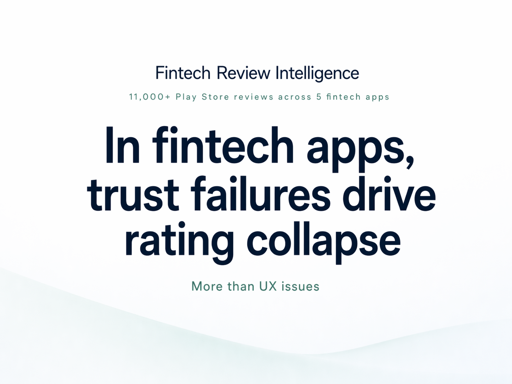

  

<h1 align="center">Fintech Review Intelligence</h1>

  <strong>11,000 Play Store reviews.</strong> <strong>5 major Indian fintech apps.</strong> 
  A product intelligence project built to figure out which kinds of failures actually damage trust, and which complaints users still tolerate when the core product works.

  
  
  
  

## Why this project exists

A lot of review analysis projects stop at sentiment, star ratings, or keyword counts. That is fine for a dashboard. It is not that useful for product decisions.

I built this project to answer a more practical question:

**What kinds of product failures actually damage trust in fintech, and which complaints remain survivable when the core product still works?**

The project analyzes reviews across Groww, Jupiter, CRED, PhonePe, and Paytm, then turns them into a more decision-useful output using SQL analysis, complaint classification, and a structured multi-model review step.

## The question behind the project

The project started with a simple product question: what kinds of failures actually damage trust in fintech products, and which complaints do users still tolerate when the core product works?

After the analysis phase, the council sharpened that into a more specific one: what should product teams change when support activity is high but trust and account-access failures still keep dragging ratings down?

That framing mattered because it pushed the project away from generic review analysis and toward a harder product question: which problems create noise, and which ones signal structural risk?

## What the project found

### 1. Trust and account-access failures damage fintech products far more than UX friction

The clearest pattern in the dataset came from Jupiter. It stood apart from the rest of the app set with much weaker ratings and a complaint mix clustered around onboarding, trust, and account access rather than ordinary usability friction.

That matters because it points to a different kind of product failure. In most consumer apps, users complain about clutter, confusing navigation, or small bugs and still keep using the product. In fintech, the reaction changes when the problem touches money, identity, verification, or access. Once users feel they may lose control over their account or hit an unexplained block in a financial workflow, ratings collapse quickly.

That was the strongest cross-app signal in the project: users can live with friction, but they do not live well with uncertainty around trust and access.

### 2. High support responsiveness does not repair a broken core flow

One of the more interesting results came from comparing complaint patterns with developer reply behavior.

Jupiter showed very high developer reply coverage on low-rated reviews. On the surface, that looks like strong responsiveness. In practice, it did not meaningfully improve user sentiment. The pattern suggests that reactive support does little when the underlying issue sits in onboarding, account access, or trust-sensitive flows.

A fast reply can help when the issue is isolated or informational. It helps much less when the user believes the core product has failed at a moment that affects money, control, or verification.

### 3. Strong products can absorb UX complaints when core reliability holds

PhonePe and Groww were useful contrasts. Both still attracted complaints around interface clutter, friction, or general usability, but those complaints did not produce the kind of rating collapse seen in Jupiter.

The point is not that UX does not matter. It does. The review data just suggests that users judge fintech products unevenly. They are more forgiving of design friction than of failures tied to trust, onboarding, or core utility. If the product still works when it matters, a fair amount of UX pain remains survivable.

### 4. Complaint type matters more than raw negativity

A big part of the project was moving beyond simple negative-review counting.

Instead of treating all 1-star reviews as the same, the pipeline separates different kinds of failure: UX friction, transaction issues, onboarding problems, trust breakdowns, support-heavy complaints, and other product issues. That makes the output more useful for prioritization.

For a product team, that is the difference between "users are unhappy" and "users are unhappy for reasons that can seriously damage trust." Those are not the same thing, and they should not be handled the same way.

## Why this matters for product teams

For fintech products, review data is not just sentiment data.

It can show:

- where trust is breaking
- which workflows create the most damaging user pain
- whether support teams are absorbing issues that product teams should actually own
- which complaints are survivable and which ones point to deeper product risk

That is the core idea behind the project.

## Scope

| Area            | Details                              |
| --------------- | ------------------------------------ |
| Apps analyzed   | Groww, Jupiter, CRED, PhonePe, Paytm |
| Dataset size    | 11,000 Play Store reviews            |
| Sampling        | 2,200 recent reviews per app         |
| Market context  | India-focused fintech app set        |
| Review language | English                              |

## What I built

I built a five-phase Python pipeline:

1. **Collection**  
   Pull Play Store reviews and store them in SQLite.

2. **Analysis**  
   Run SQL analysis on ratings, review patterns, time trends, and high-signal negative feedback.

3. **Classification**  
   Apply structured complaint labels so feedback can be grouped semantically instead of only through keywords.

4. **Council**  
   Use a staged multi-model review process to pressure-test weak interpretations and sharpen final conclusions.

5. **Report**  
   Generate output artifacts that are readable both for technical inspection and for product-facing communication.

## How the analysis works

The analysis layer has two parts.

### Base analysis

- cross-app summary statistics
- high-signal low-rating reviews
- keyword frequency patterns
- rating trends over time
- weekly review volume and anomaly signals
- developer reply behavior

### Classification enrichment

- complaint category breakdowns
- over-indexing by app
- top classified complaint examples
- stronger semantic interpretation of low-rated feedback

This keeps the project grounded in direct SQL signals first, then adds richer complaint diagnosis on top.

## Structured synthesis

Instead of asking one model to write the final report in one shot, I used a staged multi-model review process.

The goal was to make weak conclusions fight a bit before they made it into the output. The review layer sets a core question, runs independent specialist analyses, challenges weak logic, audits evidence, and then writes a final synthesis.

That helped keep the final report closer to the data and less like a polished one-shot summary.

## Outputs

The repository generates a set of working outputs, including:

- `reviews.db`
- `findings_summary.json`
- `council_result.json`
- `findings_report.md`
- `linkedin_snippet.txt`

## Skills this project shows

- product thinking through complaint prioritization and cross-app interpretation
- SQL-based analysis on structured review data
- Python pipeline design
- SQLite-based storage and checkpointing
- turning unstructured feedback into more useful analytical output
- communicating findings in a form that supports product decisions

## Tech stack

- Python
- SQLite
- SQL
- Play Store review scraping
- LLM-based complaint classification and synthesis

## Repository goal

This repository is meant to show a kind of profile I want to keep building toward:

**someone who can combine business thinking, product judgment, and technical execution to generate useful insight from messy real-world data.**
